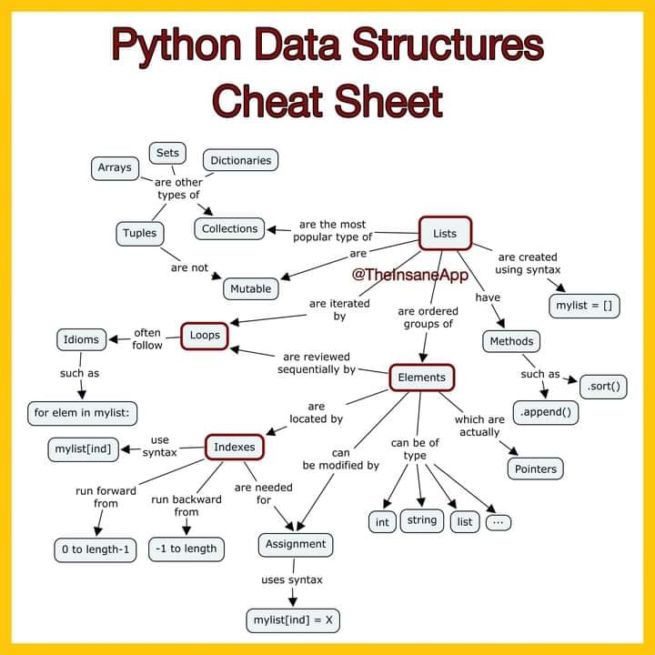
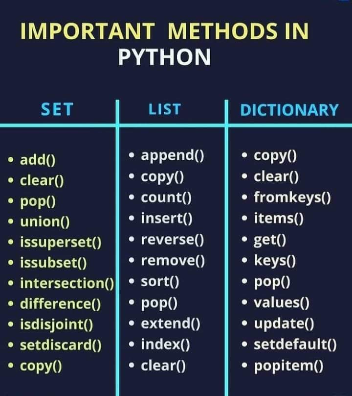
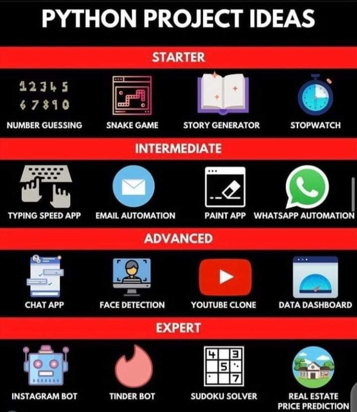

# PYTHON-DOCUMENTATION

[![Youtube][youtube-shield]][@learnwithfair]
[![Facebook][facebook-shield]][learnwithfair]
[![Instagram][instagram-shield]][learnwithfair]
[![LinkedIn][linkedin-shield]][learnwithfair]

Thanks for visiting my GitHub account!

 **Python** is a high-level, general-purpose programming language. Its design philosophy emphasizes code readability with the use of significant indentation. Python is dynamically typed and garbage-collected. It supports multiple programming paradigms, including structured, object-oriented and functional programming [see-more](https://www.w3schools.com/python/python_intro.asp)

### [Code-Example](https://github.com/learnwithfair/python)

## Source Code (Download)

- [Documentation](https://mega.nz/folder/RGFiUApD#PoKIVCwF8IkQhE2PHw1XxQ)
- [Sample-Code](https://mega.nz/folder/ZfchHTgQ#RGMrPIhP7e2hPdLT2YnYHg)

## Python (OOPs)

Python is a popular programming language. It was created by Guido van Rossum, and released in 1991.

**It is used for**

- web development (server-side),
- software development,
- mathematics,
- system scripting.

### Features of Python

|                                                                                                     |
| :-------------------------------------------------------------------------------------------------: |
|                                              Features                                               |
|  |

**_See More_**
https://www.w3schools.com/python/python_intro.asp Or, https://www.tutorialspoint.com/python/index.htm

## Required Software (Download)

- Python, Download-> https://www.python.org/downloads/
- Pycharm (Community), Download-> https://www.jetbrains.com/pycharm/download/?section=windows
- Or, Visual Studio, Download-> https://code.visualstudio.com/download
- For MySQL Database, Download-> https://www.mysql.com/downloads/

## Project Roadmap

|                                  |
| :------------------------------: |
|           Cheat-Sheet            |
|  |

|                              |
| :--------------------------: | :------------------------------: |
|            Method            |             Projects             |
|  |  |

## Python Install

Many PCs and Macs will have Python already installed.
To check if you have Python installed on a Windows PC, search in the start bar for Python or run the following on the Command Line (cmd.exe):

```diff
python --version
```

## The Python Command Line

```diff
C:\Users\Your Name>python
```

Or, if the "python" command did not work, you can try "py"

```diff
C:\Users\Your Name>py
```

From there you can write any Python, including our hello world example from earlier in the tutorial

```diff
>>> print("Hello, World!")
```

## Python MySQL (Database)

To be able to experiment with the code examples in this tutorial, you should have MySQL installed on your computer.
You can download a MySQL database at https://www.mysql.com/downloads/.

### Connect the database as follows

- Install MySQL Driver
- Python needs a MySQL driver to access the MySQL database. In this tutorial, we will use the driver "MySQL Connector".
- We recommend that you use PIP to install "MySQL Connector".
- PIP is most likely already installed in your Python environment.

Navigate your command line to the location of PIP, and type the following-

### Download and install "MySQL Connector"

```diff
C:\Users\Your Name\AppData\Local\Programs\Python\Python36-32\Scripts>python -m pip install mysql-connector-python
```

### Create Connection

**_demo_mysql_connection.py_**

```diff
import mysql.connector

mydb = mysql.connector.connect(
  host="localhost",
  user="yourusername",
  password="yourpassword"
)

print(mydb)
```

[See More](https://www.w3schools.com/python/python_mysql_getstarted.asp)

## Project Overview

|                                                                                            |
| :----------------------------------------------------------------------------------------: |
|                                           Basic                                            |
|       |
|                                          Advance                                           |
|  |

## Follow Me

 [Facebook](http://facebook.com/learnwithfair),  [Youtube](http://youtube.com/@learnwithfair),  [Instagram](http://instagram.com/learnwithfair)
